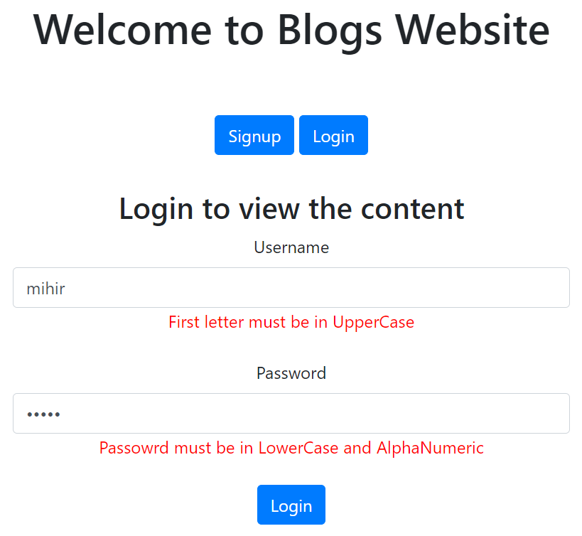
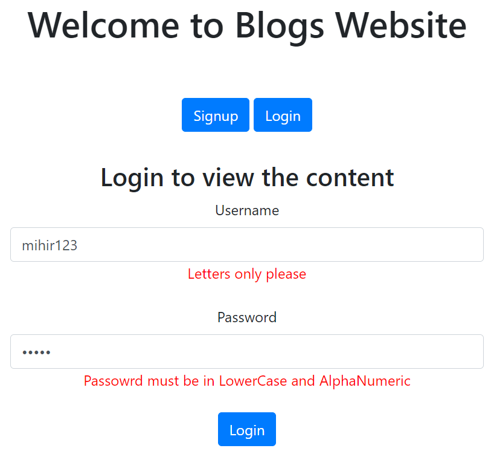
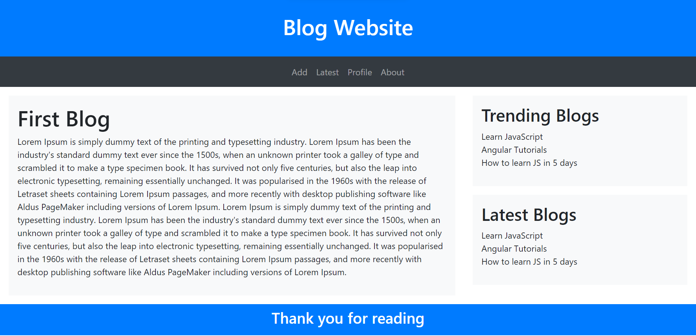
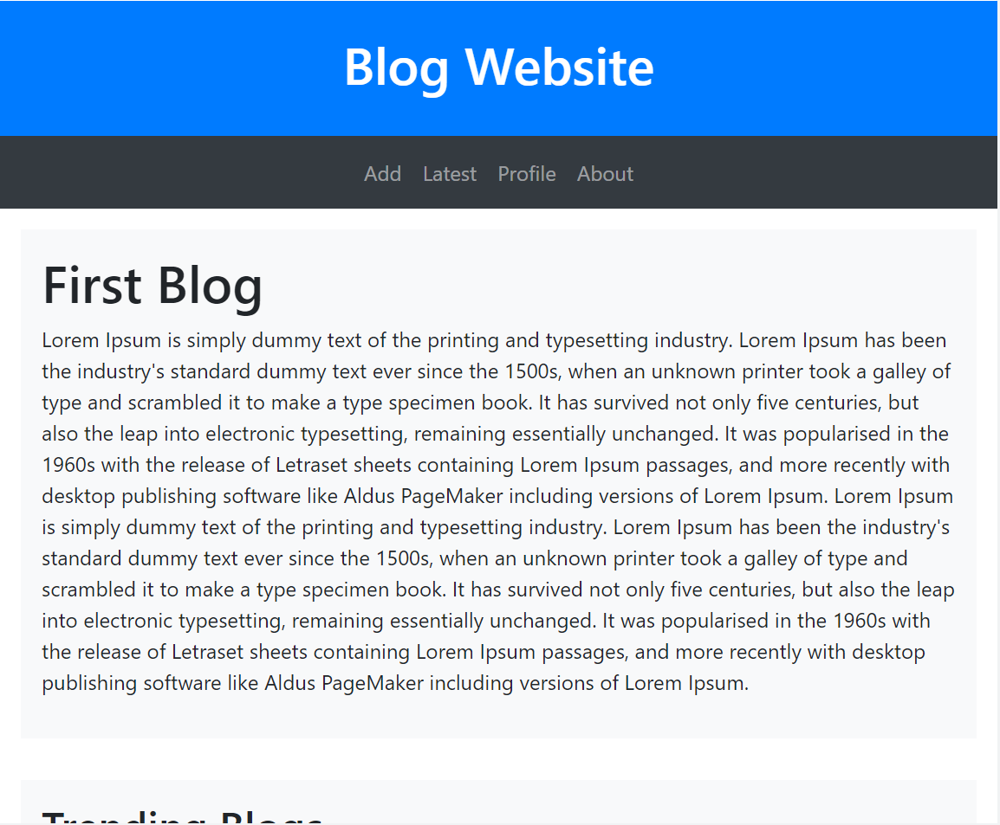
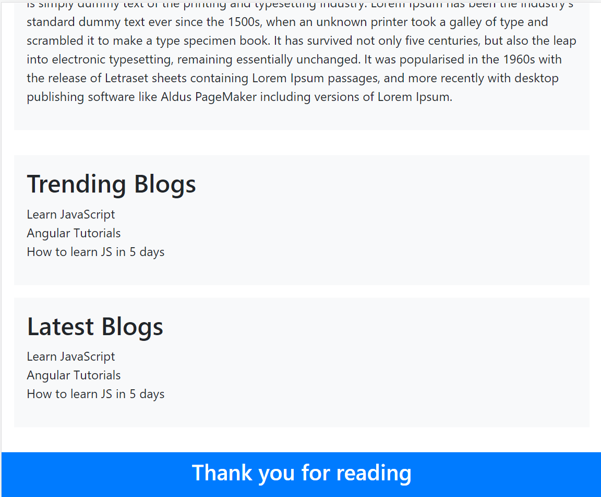
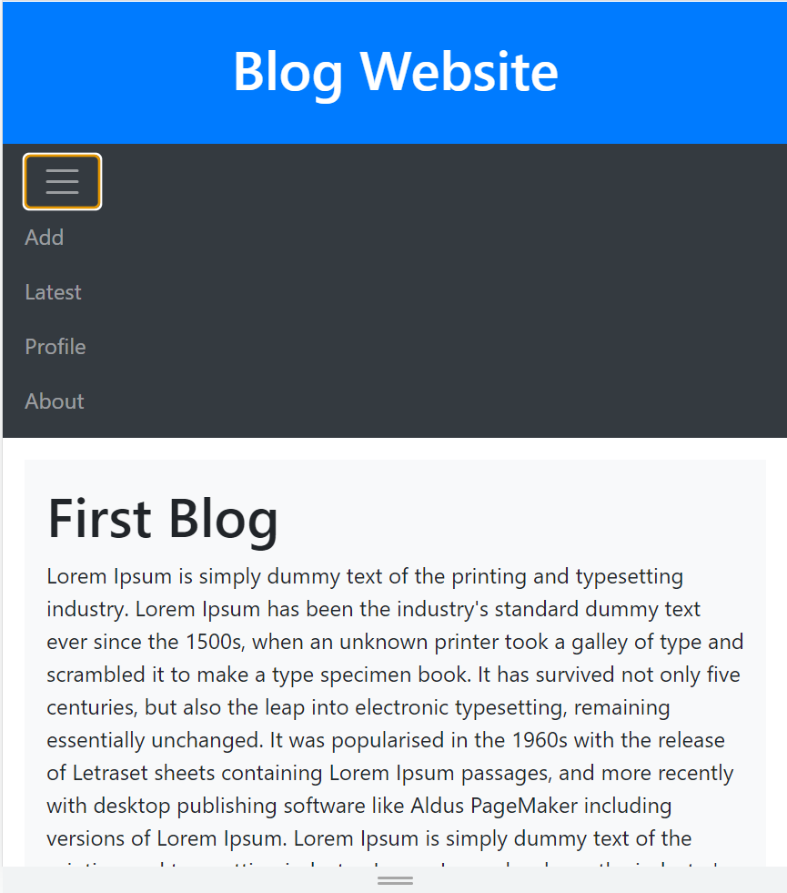
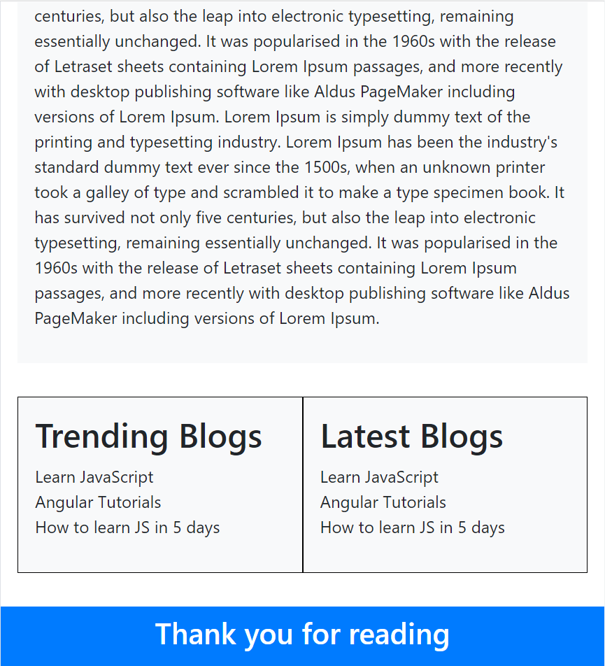

# Blog Website

Created a dynamic and user-friendly blog website by incorporating responsive design, breakpoints, blog sections, form validation, and Bootstrap integration.

## Features

- **Responsive Design:** The website adapts to various screen sizes for an optimal user experience.

- **Breakpoints:**
  - 768px width: Trending and latest blogs are appended below the main blog.
  - 576px width: Trending and latest blogs are displayed side by side below the main blog. Navigation bar is replaced with a toggler.

- **Blog Sections:**
  - Main Blog Content: Features a blog post.
  - Trending Blogs: Displays list of trending blog posts.
  - Latest Blogs: Displays list of the most recent blog posts.

- **Form Validation (jQuery):**
  - Username Validation: Must start with a capital letter and contain only letters.
  - Password Validation: Must be in lowercase and alphanumeric.

- **Bootstrap Integration:**
  - Utilizes Bootstrap for responsive layout, styling, and components.

## Components

1. **Login/Sign Up page:**
   - Users can log in or sign up to access content.
   - Inputs for username and password.

2. **Navigation Bar:**
   - Provides navigation links to different features of the website.

3. **Blog Content:**
   - Main area displaying blog posts.

4. **Trending Blogs Section:**
   - Displays list of trending blog posts.
   - Positioned below main content at 768px breakpoint.
   - Positioned side by side at 576px breakpoint.

5. **Latest Blogs Section:**
   - Displays list of recent blog posts.
   - Positioned below main content at 768px breakpoint.
   - Positioned side by side at 576px breakpoint.

6. **Toggle Button:**
   - Replaces navigation bar at 576px breakpoint.
   - Toggles display of navigation links.

## Form Validation (jQuery)

1. **Username Validation:**
   - Must start with a capital letter.
   - Only letters are allowed.

2. **Password Validation:**
   - Must be in lowercase.
   - Only alphanumeric characters are allowed.

## Bootstrap Integration

1. **Responsive Grid System:**
   - Utilize Bootstrap's grid system for responsive layouts.

2. **Styling Components:**
   - Enhance appearance with Bootstrap's styling components.

3. **Navigation Bar and Toggle:**
   - Use Bootstrap's navigation components and toggler for navigation and toggle button at different breakpoints.

## Screenshots

  
   
  <em>Login/Signup Page</em>

  
   
  <em>Form Validation</em>

  
   
  <em>Form Validation</em>

  
   
  <em>Home Page</em>

  
   
  <em>Home Page break point 768px</em>

  
   
  <em>Home Page break point 768px</em>

  
   
  <em>Home Page break point 576px</em>

  
   
  <em>Home Page break point 576px</em>

